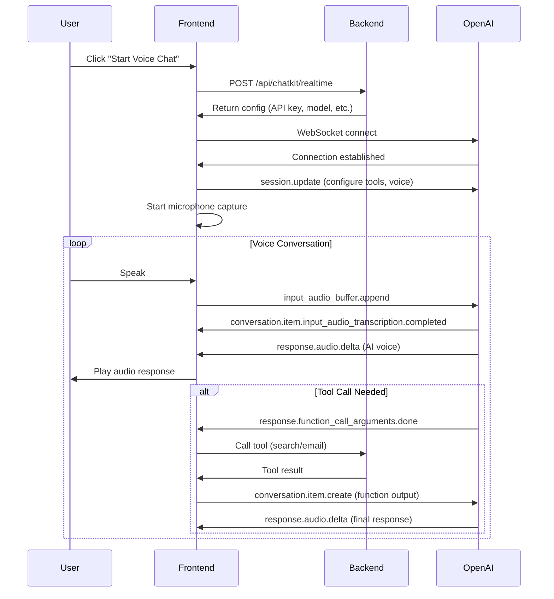

# GPT Realtime Mini Integration Guide

## Overview

The TradeZone Chatbot Dashboard integrates OpenAI's **GPT-4o-mini Realtime API** for low-latency, voice-enabled conversations. This enables customers to have natural voice conversations with Izacc, the AI assistant, with real-time audio streaming and function calling capabilities.

## Architecture

### Components

1. **Backend API** (`/app/api/chatkit/realtime/route.ts`)
   - Provides WebSocket configuration
   - Securely manages API keys
   - Returns model settings and vector store ID

2. **Frontend Component** (`/components/realtime-voice.tsx`)
   - Establishes WebSocket connection to OpenAI
   - Captures microphone audio (PCM16 @ 24kHz)
   - Streams audio to OpenAI Realtime API
   - Receives and plays back AI responses
   - Handles function calling for tools

3. **Chat Interface** (`/app/dashboard/chat/page.tsx`)
   - Text/Voice mode toggle
   - Displays conversation transcripts
   - Session management

## Features

### ✅ Implemented

- **Real-time Voice Conversations**: Low-latency bidirectional audio streaming
- **Audio Playback**: Queued PCM16 audio playback with Web Audio API
- **Speech-to-Text**: Automatic transcription of user speech (Whisper-1)
- **Text-to-Speech**: Natural voice responses (configurable voice)
- **Function Calling**: Integration with TradeZone tools:
  - `searchtool`: Product search via vector store and web
  - `sendemail`: Send inquiry emails to staff
- **Server VAD**: Automatic turn detection (Voice Activity Detection)
- **Session Management**: Unique session IDs for conversation tracking

### 🎯 Key Capabilities

- **Multimodal**: Supports both audio and text input/output
- **Tool Integration**: Can search products and send emails during voice calls
- **Natural Conversations**: Server-side turn detection for fluid dialogue
- **Cost-Efficient**: Uses GPT-4o-mini-realtime-preview by default

## Setup Instructions

### 1. Environment Variables

Add to your `.env.local` file:

```env
# OpenAI Configuration (Server-side)
OPENAI_API_KEY=sk-proj-your-openai-api-key
OPENAI_VECTOR_STORE_ID=vs_your_vector_store_id

# Optional: Choose model (defaults to gpt-4o-mini-realtime-preview-2024-12-17)
OPENAI_REALTIME_MODEL=gpt-4o-mini-realtime-preview-2024-12-17

# For web search functionality
PERPLEXITY_API_KEY=pplx-your-perplexity-api-key

# Supabase (for logging)
NEXT_PUBLIC_SUPABASE_URL=your_supabase_url
SUPABASE_SERVICE_ROLE_KEY=your_service_role_key
```

### 2. OpenAI Setup

#### Create Vector Store

1. Go to [OpenAI Platform](https://platform.openai.com/)
2. Navigate to **Storage** → **Vector Stores**
3. Create a new vector store
4. Upload your product catalog files
5. Copy the Vector Store ID (format: `vs_xxxxx`)

#### Get API Key

1. Go to [API Keys](https://platform.openai.com/api-keys)
2. Create a new secret key
3. Copy the key (format: `sk-proj-xxxxx`)

### 3. Model Selection

Two models are available:

| Model | Cost | Latency | Use Case |
|-------|------|---------|----------|
| `gpt-4o-mini-realtime-preview-2024-12-17` | Lower | ~200ms | Production (default) |
| `gpt-4o-realtime-preview-2024-12-17` | Higher | ~150ms | Premium experience |

Set via `OPENAI_REALTIME_MODEL` environment variable.

#### ⚠️ Known Issue: Model Fallback

**Important**: There's a known issue where the API may fall back to `gpt-4o-realtime-preview-2024-12-17` even when you specify the mini model. This means you could be charged for the full GPT-4o Realtime pricing.

**How to verify which model is actually being used:**

1. Open browser console
2. Look for `[Realtime Session]:` log after connection
3. Check the `model` field:
   ```javascript
   [Realtime Session]: {
     model: "gpt-4o-mini-realtime-preview-2024-12-17",  // ✅ Using mini
     // OR
     model: "gpt-4o-realtime-preview-2024-12-17"  // ⚠️ Fell back to full
   }
   ```

**If you see the fallback:**
- This is an OpenAI API issue (not your code)
- You'll be charged at full GPT-4o Realtime rates
- Monitor your usage on [OpenAI Platform](https://platform.openai.com/usage)
- Consider setting usage limits in your OpenAI account

**References:**
- [OpenAI Community Discussion](https://community.openai.com/t/issues-forcing-gpt-4o-mini-model-in-realtime-api-fallback-to-gpt-4o-realtime-preview/1114213)

## How It Works

### WebSocket Connection Flow



### Audio Processing

#### Input (User → OpenAI)

1. Capture microphone at 24kHz sample rate
2. Convert Float32 to PCM16 (Int16)
3. Encode to Base64
4. Send via WebSocket: `input_audio_buffer.append`

#### Output (OpenAI → User)

1. Receive Base64 PCM16 chunks via `response.audio.delta`
2. Decode Base64 to Uint8Array
3. Convert to Int16Array
4. Queue audio chunks
5. Convert PCM16 to Float32
6. Create AudioBuffer and play via Web Audio API

### Event Types

#### Client → Server

- `session.update`: Configure session (modalities, voice, tools)
- `input_audio_buffer.append`: Stream user audio
- `conversation.item.create`: Send function results
- `response.create`: Request AI response

#### Server → Client

- `conversation.item.input_audio_transcription.completed`: User speech transcript
- `response.audio_transcript.delta`: AI response transcript (streaming)
- `response.audio.delta`: AI voice audio chunks
- `response.function_call_arguments.done`: Tool call request
- `response.done`: Response complete
- `error`: Error occurred

## Function Calling

### Available Tools

#### 1. searchtool

Search TradeZone products using vector store and web search.

```typescript
{
  type: "function",
  name: "searchtool",
  description: "Search for TradeZone products including gaming consoles, laptops, phones, accessories, pricing and availability.",
  parameters: {
    type: "object",
    properties: {
      query: {
        type: "string",
        description: "The product search query"
      }
    },
    required: ["query"]
  }
}
```

#### 2. sendemail

Send inquiry emails to TradeZone staff.

```typescript
{
  type: "function",
  name: "sendemail",
  description: "Send an email inquiry to TradeZone staff. Only use when customer explicitly requests to be contacted.",
  parameters: {
    type: "object",
    properties: {
      emailType: {
        type: "string",
        enum: ["trade_in", "info_request", "contact"]
      },
      name: { type: "string" },
      email: { type: "string" },
      phone_number: { type: "string" },
      message: { type: "string" }
    },
    required: ["emailType", "name", "email", "message"]
  }
}
```

### Tool Execution Flow

1. OpenAI decides to call a tool
2. Frontend receives `response.function_call_arguments.done` event
3. Frontend calls backend API endpoint (`/api/tools/perplexity` or `/api/tools/email`)
4. Backend executes tool and returns result
5. Frontend sends result back to OpenAI via `conversation.item.create`
6. Frontend triggers new response via `response.create`
7. OpenAI incorporates tool result and responds

## Usage

### Starting a Voice Session

```typescript
import { RealtimeVoice } from "@/components/realtime-voice";

<RealtimeVoice
  sessionId="Guest-1234"
  onTranscript={(text, role) => {
    console.log(`${role}: ${text}`);
  }}
/>
```

### Accessing from Dashboard

1. Navigate to `/dashboard/chat`
2. Click **"VOICE CHAT"** button
3. Click **"Start Voice Chat"**
4. Allow microphone access when prompted
5. Start speaking naturally

## Debugging

### Common Issues

#### 1. No Audio Playback

**Symptoms**: Can hear yourself, but AI doesn't respond with audio

**Solutions**:
- Check browser console for `[Audio Playback Error]`
- Verify `response.audio.delta` events are received
- Ensure Web Audio API is supported (modern browsers)
- Check audio output device is working

#### 2. WebSocket Connection Fails

**Symptoms**: "Connection error" status

**Solutions**:
- Verify `OPENAI_API_KEY` is set correctly
- Check API key has Realtime API access
- Ensure `OPENAI_VECTOR_STORE_ID` is valid
- Check browser console for WebSocket errors

#### 3. Microphone Access Denied

**Symptoms**: "Microphone access denied" alert

**Solutions**:
- Grant microphone permissions in browser settings
- Use HTTPS (required for getUserMedia)
- Check browser compatibility

#### 4. Tool Calls Not Working

**Symptoms**: AI doesn't search products or send emails

**Solutions**:
- Verify `PERPLEXITY_API_KEY` is set (for search)
- Check `/api/tools/perplexity` endpoint is accessible
- Ensure Supabase credentials are configured
- Review browser console for tool execution errors

### Logging

Enable detailed logging in browser console:

```javascript
// All Realtime events are logged with prefix [Realtime Event]:
// - Connection status
// - Transcripts (user and assistant)
// - Tool calls
// - Audio chunks
// - Errors
```

### Testing Checklist

- [ ] WebSocket connects successfully
- [ ] Microphone captures audio
- [ ] User speech is transcribed
- [ ] AI responds with audio
- [ ] Audio playback is smooth
- [ ] Product search tool works
- [ ] Email tool works
- [ ] Session persists across page refresh
- [ ] Graceful disconnection on stop

## Performance Optimization

### Audio Quality

- **Sample Rate**: 24kHz (optimal for Realtime API)
- **Format**: PCM16 (16-bit signed integer)
- **Channels**: Mono (1 channel)
- **Echo Cancellation**: Enabled
- **Noise Suppression**: Enabled

### Latency Reduction

- **Server VAD**: Automatic turn detection (no manual push-to-talk)
- **Streaming**: Audio chunks played as received (no buffering)
- **Model**: GPT-4o-mini for faster responses
- **Buffer Size**: 4096 samples for audio processing

### Cost Management

Using `gpt-4o-mini-realtime-preview-2024-12-17`:
- **Audio Input**: ~$0.06 per million tokens (~$0.10/hour of audio)
- **Audio Output**: ~$0.24 per million tokens (~$0.40/hour of audio)
- **Text Input/Output**: Standard GPT-4o-mini rates

Compared to `gpt-4o-realtime-preview-2024-12-17`:
- **Savings**: ~60% cost reduction
- **Latency**: Minimal difference (~50ms)

## Browser Compatibility

| Browser | Version | Support |
|---------|---------|---------|
| Chrome | 90+ | ✅ Full |
| Edge | 90+ | ✅ Full |
| Safari | 14.1+ | ✅ Full |
| Firefox | 88+ | ✅ Full |
| Mobile Safari | iOS 14.5+ | ✅ Full |
| Mobile Chrome | Android 90+ | ✅ Full |

**Requirements**:
- WebSocket support
- Web Audio API
- MediaDevices.getUserMedia
- HTTPS (for microphone access)

## Security Considerations

1. **API Key Protection**: Never expose `OPENAI_API_KEY` to client
2. **Backend Proxy**: Configuration endpoint validates session
3. **HTTPS Required**: Microphone access requires secure context
4. **Session Validation**: Each session has unique ID
5. **Tool Authorization**: Email tool requires explicit user request

## Future Enhancements

- [ ] Voice selection (alloy, echo, fable, onyx, nova, shimmer)
- [ ] Audio visualization (waveform display)
- [ ] Conversation history persistence
- [ ] Multi-language support
- [ ] Custom wake word detection
- [ ] Background noise filtering
- [ ] Audio quality settings
- [ ] Recording/playback of conversations

## References

- [OpenAI Realtime API Documentation](https://platform.openai.com/docs/guides/realtime)
- [GPT-4o-mini Realtime Model](https://platform.openai.com/docs/models/gpt-4o-mini-realtime-preview)
- [Web Audio API](https://developer.mozilla.org/en-US/docs/Web/API/Web_Audio_API)
- [MediaDevices.getUserMedia](https://developer.mozilla.org/en-US/docs/Web/API/MediaDevices/getUserMedia)

## Support

For issues or questions:
- Check browser console for detailed error logs
- Review this guide's debugging section
- Contact TradeZone development team
- Email: contactus@tradezone.sg
